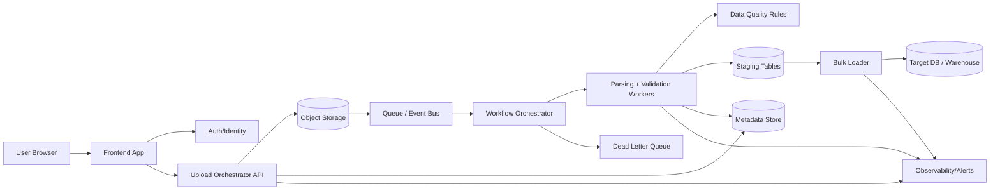

# Huge CSV Import Architecture (Frontend -> DB)

This document proposes a practical, production-grade component architecture for importing very large CSV files, with technology choices and a full component diagram.

**Goal:** reliable, resumable uploads; scalable parsing/validation; fast bulk loads into the target database; strong observability and error handling.

## Recommended Architecture (Cloud-Agnostic Pattern)

**Core idea:** the browser uploads directly to object storage using resumable/multipart uploads and a time-limited upload token; the backend orchestrates processing and bulk-loads data into the database.

## Component Diagram (Mermaid)

## What Each Layer Does

- **Frontend App**: initiates uploads, tracks progress, and resumes failed uploads. Uses storage-native resumable/multipart uploads for large files and time-limited upload tokens. citeturn4search0turn0search0
- **Upload Orchestrator API**: authenticates the user, issues upload tokens/URLs, and records import metadata. Presigned URLs enable direct uploads without giving the client long-lived storage credentials. citeturn2search4
- **Object Storage**: durable, scalable file storage (e.g., S3/GCS/Azure Blob). Large files are uploaded as parts/blocks or via resumable sessions. citeturn4search0turn0search0turn3search2turn0search4
- **Queue / Event Bus**: decouples user upload from heavy processing; workers scale independently. SQS is a common managed queue; Kafka is a strong option for high-throughput streaming. citeturn4search6turn2search0
- **Workflow Orchestrator**: coordinates multi-step imports (validate → transform → load), retries failed steps, and routes failures to DLQ.
- **Parsing + Validation Workers**: stream/partition the CSV, apply schema rules, and write to staging tables. Great Expectations is a common OSS choice for data validation and data quality reporting. citeturn4search2turn4search4
- **Bulk Loader**: loads data from staging into the target DB using native bulk-load commands (fastest path). citeturn3search4turn1search2turn1search1
- **Bulk Loader (PostgreSQL)**: `COPY`. citeturn3search4
- **Bulk Loader (MySQL)**: `LOAD DATA INFILE`. citeturn1search2
- **Bulk Loader (Snowflake)**: `COPY INTO <table>`. citeturn1search1

## Suggested Technology Choices by Layer

These are safe defaults; pick the cloud-native equivalents in your platform.

- **Frontend**: web app with resumable/multipart uploads to storage using presigned URLs. citeturn4search0turn0search0turn2search4
- **API**: upload orchestration service that issues presigned URLs and tracks import jobs. citeturn2search4
- **Storage (AWS)**: S3 with multipart upload (recommended for large files). citeturn4search0
- **Storage (GCP)**: Cloud Storage with resumable uploads. citeturn0search0
- **Storage (Azure)**: Blob Storage block blobs (Put Block/Put Block List). citeturn3search2turn0search4
- **Queue**: SQS for managed queuing; Kafka for high-throughput, partitioned streaming. citeturn4search6turn2search0
- **Validation**: Great Expectations for expectation-based checks and data docs. citeturn4search2turn4search4
- **Processing**: distributed batch engine (e.g., Spark) for large-scale parsing and transforms. citeturn5search5
- **DB Loader (PostgreSQL)**: `COPY`. citeturn3search4
- **DB Loader (MySQL)**: `LOAD DATA INFILE`. citeturn1search2
- **DB Loader (Snowflake)**: `COPY INTO <table>`. citeturn1search1

## End-to-End Flow (Typical)

1. User selects a CSV in the browser.
2. Frontend requests an upload session from the API.
3. API returns a presigned upload URL (or resumable upload session info). citeturn2search4
4. Browser uploads directly to object storage using multipart/resumable upload. citeturn4search0turn0search0
5. Storage notifies or the API enqueues a message to start processing.
6. Orchestrator schedules parsing/validation workers.
7. Workers validate rows, write clean data to staging, and log errors.
8. Bulk loader runs a native bulk-load command to move data into the target DB. citeturn3search4turn1search2turn1search1
9. Metadata store records job status; observability alerts on failures.

## Notes on “Best” Choices

- **Huge files**: prefer storage-native multipart/resumable uploads to avoid restarting large transfers after a network failure. citeturn4search0turn0search0
- **Fastest DB ingest**: use each database’s native bulk loader instead of row-by-row inserts. citeturn3search4turn1search2turn1search1
- **Reliability**: a queue decouples upload from processing and lets you retry safely. citeturn4search6

