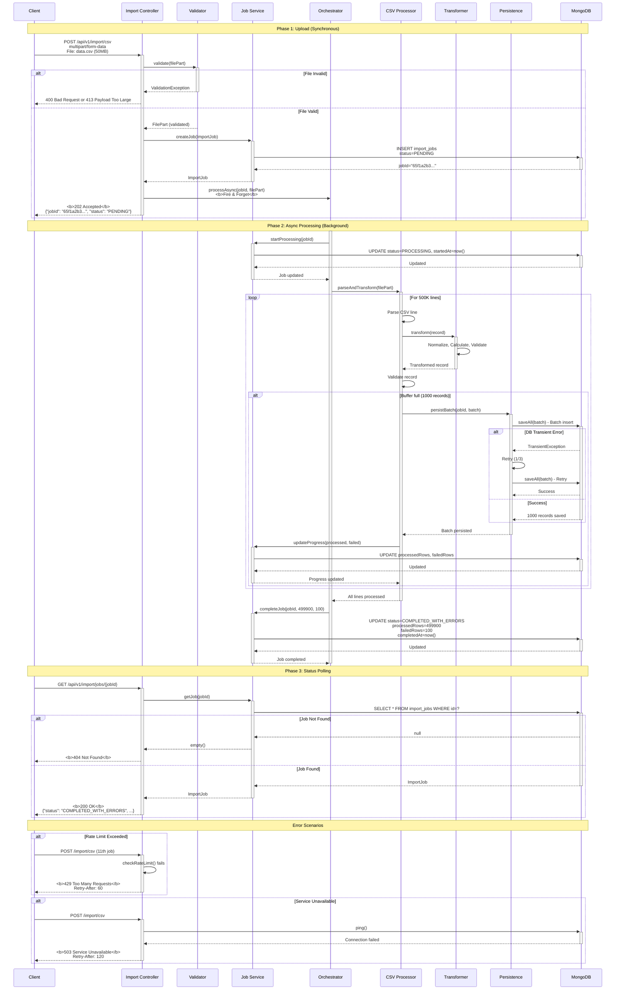

# Bulk CSV Import - Sequence Diagram with HTTP Status Codes

**Author:** Principal Engineering Team  
**Date:** March 22, 2026  
**Version:** 1.0

---

## Complete Flow Visualization

This document provides a detailed sequence diagram showing the complete bulk CSV import flow including all HTTP status codes, error scenarios, and processing phases.

---

## Overview

```
┌─────────┐         ┌──────────┐         ┌──────────┐         ┌─────────┐
│ Client  │ ──────> │ Producer │ ──────> │ Consumer │ ──────> │ MongoDB │
└─────────┘         └──────────┘         └──────────┘         └─────────┘
   Upload            Validate &           Process &            Persist
   (sync)            Create Job          Transform             Data
                     202 Accepted         (async)
```

---

## Sequence Diagram

### Phase 1: Upload & Job Creation (Synchronous)

```
Client                Controller            Validator           JobService          MongoDB
  │                       │                     │                    │                 │
  │──POST /import/csv────>│                     │                    │                 │
  │   multipart/form      │                     │                    │                 │
  │   data.csv (50MB)     │                     │                    │                 │
  │                       │                     │                    │                 │
  │                       │──validate(file)────>│                    │                 │
  │                       │                     │                    │                 │
  │                       │                     │──Check size────────│                 │
  │                       │                     │──Check type────────│                 │
  │                       │                     │──Sanitize name─────│                 │
  │                       │                     │                    │                 │
  │                       │<────✓ Valid─────────│                    │                 │
  │                       │                     │                    │                 │
  │                       │──createJob()───────────────────────────>│                 │
  │                       │                     │                    │                 │
  │                       │                     │                    │──INSERT job────>│
  │                       │                     │                    │   status=PENDING│
  │                       │                     │                    │<────id=65f1a───│
  │                       │<────ImportJob───────────────────────────│                 │
  │                       │                     │                    │                 │
  │                       │──processAsync()──┐  │                    │                 │
  │                       │  (fire & forget) │  │                    │                 │
  │                       │                  │  │                    │                 │
  │<─────202 ACCEPTED─────│                  │  │                    │                 │
  │  {                    │                  │  │                    │                 │
  │    "jobId": "65f1a",  │                  │  │                    │                 │
  │    "status": "PENDING"│                  │  │                    │                 │
  │  }                    │                  │  │                    │                 │
  │                       │                  │  │                    │                 │
```

### Phase 2: Async Processing (Background)

```
                         Orchestrator      CsvProcessor      Transform       Persistence       MongoDB
                              │                 │                │                │              │
                              │<────────────────┘                │                │              │
                              │  (from async)                    │                │              │
                              │                                  │                │              │
                              │──startProcessing()──────────────────────────────────────────────>│
                              │                                  │                │              │
                              │                                  │                │              │──UPDATE
                              │                                  │                │              │  status=
                              │                                  │                │              │  PROCESSING
                              │<─────────────────────────────────────────────────────────────────│
                              │                                  │                │              │
                              │──parseAndTransform()───────────>│                │              │
                              │                                  │                │              │
                              │                                  │──For each line:│              │
                              │                                  │  parse CSV────>│              │
                              │                                  │                │              │
                              │                                  │──transform()──>│              │
                              │                                  │                │              │
                              │                                  │                │  • Normalize │
                              │                                  │                │  • Calculate │
                              │                                  │                │  • Validate  │
                              │                                  │<───record─────│              │
                              │                                  │                │              │
                              │                                  │──validate()────│              │
                              │                                  │                │              │
                              │                                  │  ┌─Buffer─────┐              │
                              │                                  │  │ 1000 recs  │              │
                              │                                  │  └────────────┘              │
                              │                                  │                │              │
                              │                                  │──When buffer full:           │
                              │                                  │                │              │
                              │                                  │──persistBatch()──────────────>│
                              │                                  │                │              │
                              │                                  │                │──saveAll()──>│
                              │                                  │                │   (batch     │
                              │                                  │                │   insert)    │
                              │                                  │                │              │
                              │                                  │                │<─✓ Saved────│
                              │                                  │<────────────────────────────  │
                              │                                  │                │              │
                              │                                  │──updateProgress()────────────>│
                              │                                  │                │              │
                              │                                  │                │──UPDATE────>│
                              │                                  │                │  processed++ │
                              │<─────────────────────────────────│                │              │
                              │                                  │                │              │
                              │  [Repeat for all 500 batches]   │                │              │
                              │                                  │                │              │
                              │──completeJob()──────────────────────────────────────────────────>│
                              │   (499900 success, 100 failed)   │                │              │
                              │                                  │                │              │
                              │                                  │                │──UPDATE────>│
                              │                                  │                │  status=     │
                              │                                  │                │  COMPLETED   │
                              │                                  │                │  _WITH_ERRORS│
                              │<─────────────────────────────────────────────────────────────────│
                              │                                  │                │              │
                       [Processing Complete: 45 seconds]        │                │              │
```

### Phase 3: Status Polling

```
Client                Controller            JobService              MongoDB
  │                       │                      │                     │
  │──GET /jobs/{jobId}───>│                      │                     │
  │                       │                      │                     │
  │                       │──getJob(jobId)──────>│                     │
  │                       │                      │──SELECT * FROM─────>│
  │                       │                      │   import_jobs       │
  │                       │                      │   WHERE id=?        │
  │                       │                      │                     │
  │                       │                      │<─────ImportJob──────│
  │                       │<─────ImportJob───────│                     │
  │                       │                      │                     │
  │<──────200 OK──────────│                      │                     │
  │  {                    │                      │                     │
  │    "status": "COMPLETED_WITH_ERRORS",        │                     │
  │    "processedRows": 499900,                  │                     │
  │    "failedRows": 100,                        │                     │
  │    "successRate": "99.98%"                   │                     │
  │  }                    │                      │                     │
```

---

## HTTP Status Codes Reference

### Success Codes

#### **202 Accepted**
- **When:** CSV file upload successful, job created
- **Meaning:** Request accepted for async processing
- **Headers:**
  - `Content-Type: application/json`
- **Body:**
  ```json
  {
    "jobId": "65f1a2b3c4d5e6f7890abcde",
    "status": "PENDING",
    "statusUrl": "/api/v1/import/jobs/65f1a2b3c4d5e6f7890abcde"
  }
  ```

#### **200 OK**
- **When:** Job status retrieval successful
- **Meaning:** Standard success response
- **Body:**
  ```json
  {
    "id": "65f1a2b3c4d5e6f7890abcde",
    "status": "COMPLETED_WITH_ERRORS",
    "processedRows": 499900,
    "failedRows": 100,
    "totalRows": 500000
  }
  ```

---

### Client Error Codes

#### **400 Bad Request**
- **When:**
  - Invalid file format
  - Invalid content type (not CSV)
  - Malformed filename (path traversal attempt)
  - Invalid query parameters
- **Body:**
  ```json
  {
    "error": "Invalid file format",
    "details": "Content-Type must be text/csv or application/csv"
  }
  ```

#### **404 Not Found**
- **When:** Job ID doesn't exist in database
- **Body:**
  ```json
  {
    "error": "Job not found",
    "jobId": "invalid-id"
  }
  ```

#### **413 Payload Too Large**
- **When:** File size exceeds 500MB limit
- **Headers:**
  - `Retry-After: 3600` (optional)
- **Body:**
  ```json
  {
    "error": "File size exceeds maximum allowed",
    "maxSize": "500MB",
    "receivedSize": "750MB"
  }
  ```

#### **429 Too Many Requests**
- **When:**
  - More than 10 concurrent import jobs
  - Rate limit exceeded (10 requests/sec)
- **Headers:**
  - `Retry-After: 60`
  - `X-RateLimit-Limit: 10`
  - `X-RateLimit-Remaining: 0`
  - `X-RateLimit-Reset: 1648000000`
- **Body:**
  ```json
  {
    "error": "Too many concurrent imports",
    "limit": 10,
    "retryAfter": 60
  }
  ```

---

### Server Error Codes

#### **500 Internal Server Error**
- **When:**
  - Unexpected server exception
  - Unhandled error during processing
- **Body:**
  ```json
  {
    "error": "Internal server error",
    "message": "An unexpected error occurred"
  }
  ```

#### **503 Service Unavailable**
- **When:**
  - MongoDB connection failed
  - System overloaded
  - Backpressure overflow
  - Maintenance mode
- **Headers:**
  - `Retry-After: 120` (seconds)
- **Body:**
  ```json
  {
    "error": "Service temporarily unavailable",
    "reason": "Database connection failed",
    "retryAfter": 120
  }
  ```

---

## Job Status Flow Diagram

```
┌──────────┐
│ PENDING  │ ◄── Initial state after upload (202 Accepted)
└────┬─────┘
     │
     │ Processing starts
     ▼
┌──────────────┐
│  PROCESSING  │ ◄── Active processing (200 OK when polled)
└──────┬───────┘
       │
       ├─────────────┬──────────────┬─────────────┐
       │             │              │             │
       │             │              │             │
       ▼             ▼              ▼             ▼
┌───────────┐  ┌─────────────┐  ┌────────┐  ┌───────────┐
│ COMPLETED │  │  COMPLETED  │  │ FAILED │  │ CANCELLED │
│           │  │ WITH_ERRORS │  │        │  │           │
└───────────┘  └─────────────┘  └────────┘  └───────────┘
   All OK      Some failed     Fatal error   User cancelled
   
   200 OK        200 OK          200 OK        200 OK
   failedRows=0  failedRows>0    errorMsg      status info
```

---

## Processing Flow Breakdown

### Step-by-Step Flow

1. **Client Upload** → `POST /api/v1/import/csv`
   - Multipart form data with CSV file
   - Immediate response: `202 Accepted` + Job ID

2. **File Validation**
   - Size check (max 500MB) → `413` if exceeded
   - Content type check → `400` if invalid
   - Filename sanitization → `400` if malicious

3. **Job Creation**
   - Insert into `import_jobs` collection
   - Status: `PENDING`
   - Return Job ID to client

4. **Async Processing** (Fire & Forget)
   - Update status: `PENDING` → `PROCESSING`
   - Parse CSV line-by-line (reactive stream)
   - Transform data (business rules)
   - Validate records
   - Batch 1000 records
   - Persist to database
   - Update progress every 1000 records

5. **Completion**
   - Update status: `PROCESSING` → `COMPLETED` or `COMPLETED_WITH_ERRORS`
   - Record final counts
   - Set completion timestamp

6. **Status Polling** → `GET /api/v1/import/jobs/{jobId}`
   - Return current status: `200 OK`
   - Include progress, success rate, timing

---

## Error Scenarios with Status Codes

### Scenario 1: File Too Large

```
Client: POST /import/csv (750MB file)
        ↓
Validator: Size check fails
        ↓
Response: 413 Payload Too Large
{
  "error": "File size exceeds maximum allowed",
  "maxSize": "500MB",
  "receivedSize": "750MB"
}
```

**Status Code:** `413 Payload Too Large`

---

### Scenario 2: Invalid Content Type

```
Client: POST /import/csv (application/pdf)
        ↓
Validator: Content type check fails
        ↓
Response: 400 Bad Request
{
  "error": "Invalid content type",
  "expected": "text/csv",
  "received": "application/pdf"
}
```

**Status Code:** `400 Bad Request`

---

### Scenario 3: Rate Limit Exceeded

```
Client: POST /import/csv (11th concurrent job)
        ↓
Controller: Rate limiter check fails
        ↓
Response: 429 Too Many Requests
Headers:
  Retry-After: 60
  X-RateLimit-Limit: 10
  X-RateLimit-Remaining: 0
Body:
{
  "error": "Too many concurrent imports",
  "retryAfter": 60
}
```

**Status Code:** `429 Too Many Requests`

---

### Scenario 4: Database Unavailable

```
Client: POST /import/csv
        ↓
Controller: MongoDB connection check fails
        ↓
Response: 503 Service Unavailable
Headers:
  Retry-After: 120
Body:
{
  "error": "Database temporarily unavailable",
  "retryAfter": 120
}
```

**Status Code:** `503 Service Unavailable`

---

### Scenario 5: Job Not Found

```
Client: GET /jobs/invalid-id
        ↓
JobService: findById returns empty
        ↓
Response: 404 Not Found
{
  "error": "Job not found",
  "jobId": "invalid-id"
}
```

**Status Code:** `404 Not Found`

---

### Scenario 6: Processing Error (Async)

```
Processing: Line 250000 - DB connection lost
        ↓
Error Handler: Retry 3 times (fails)
        ↓
JobService: failJob(jobId, errorMessage)
        ↓
MongoDB: UPDATE status=FAILED, errorMessage="DB connection lost"
        ↓
Client polls: GET /jobs/{jobId}
        ↓
Response: 200 OK (job status is FAILED)
{
  "status": "FAILED",
  "errorMessage": "Database connection lost at line 250000",
  "processedRows": 249000,
  "failedRows": 0
}
```

**Status Code for polling:** `200 OK` (status is in body)

---

## Detailed Sequence Diagram with All Phases

### Complete Flow



---

## HTTP Status Code Summary

| Status Code | Scenario | Phase | When |
|-------------|----------|-------|------|
| **202 Accepted** | Upload success | Upload | Job created, processing starts |
| **200 OK** | Status retrieval | Polling | Job found and returned |
| **400 Bad Request** | Invalid file | Upload | Bad format, type, or filename |
| **404 Not Found** | Job not found | Polling | Invalid job ID |
| **413 Payload Too Large** | File too large | Upload | File > 500MB |
| **429 Too Many Requests** | Rate limited | Upload | >10 concurrent jobs |
| **500 Internal Server Error** | Server error | Any | Unexpected exception |
| **503 Service Unavailable** | DB unavailable | Upload/Process | MongoDB down |

---

## Request/Response Examples

### Example 1: Successful Upload

**Request:**
```http
POST /api/v1/import/csv HTTP/1.1
Host: localhost:8080
Content-Type: multipart/form-data; boundary=----WebKitFormBoundary7MA4YWxkTrZu0gW

------WebKitFormBoundary7MA4YWxkTrZu0gW
Content-Disposition: form-data; name="file"; filename="data.csv"
Content-Type: text/csv

column1,column2,column3,column4,column5,column6,column7,column8,column9,column10
value1,value2,value3,value4,value5,value6,value7,value8,value9,value10
...
------WebKitFormBoundary7MA4YWxkTrZu0gW--
```

**Response:**
```http
HTTP/1.1 202 Accepted
Content-Type: application/json
Content-Length: 187

{
  "jobId": "65f1a2b3c4d5e6f7890abcde",
  "status": "PENDING",
  "message": "Import job created successfully",
  "statusUrl": "/api/v1/import/jobs/65f1a2b3c4d5e6f7890abcde",
  "timestamp": "2026-03-22T10:30:00"
}
```

---

### Example 2: Status Check (Processing)

**Request:**
```http
GET /api/v1/import/jobs/65f1a2b3c4d5e6f7890abcde HTTP/1.1
Host: localhost:8080
Accept: application/json
```

**Response:**
```http
HTTP/1.1 200 OK
Content-Type: application/json

{
  "id": "65f1a2b3c4d5e6f7890abcde",
  "filename": "data.csv",
  "status": "PROCESSING",
  "totalRows": 500000,
  "processedRows": 250000,
  "failedRows": 50,
  "fileSizeBytes": 52428800,
  "createdAt": "2026-03-22T10:30:00",
  "startedAt": "2026-03-22T10:30:05"
}
```

---

### Example 3: Status Check (Completed)

**Request:**
```http
GET /api/v1/import/jobs/65f1a2b3c4d5e6f7890abcde HTTP/1.1
Host: localhost:8080
Accept: application/json
```

**Response:**
```http
HTTP/1.1 200 OK
Content-Type: application/json

{
  "id": "65f1a2b3c4d5e6f7890abcde",
  "filename": "data.csv",
  "status": "COMPLETED_WITH_ERRORS",
  "totalRows": 500000,
  "processedRows": 499900,
  "failedRows": 100,
  "fileSizeBytes": 52428800,
  "createdAt": "2026-03-22T10:30:00",
  "startedAt": "2026-03-22T10:30:05",
  "completedAt": "2026-03-22T10:31:50"
}
```

---

### Example 4: File Too Large Error

**Request:**
```http
POST /api/v1/import/csv HTTP/1.1
Host: localhost:8080
Content-Type: multipart/form-data
Content-Length: 786432000

[750MB file data]
```

**Response:**
```http
HTTP/1.1 413 Payload Too Large
Content-Type: application/json

{
  "error": "File size exceeds maximum allowed",
  "maxSize": "500MB",
  "receivedSize": "750MB",
  "timestamp": "2026-03-22T10:30:00"
}
```

---

### Example 5: Rate Limit Exceeded

**Request:**
```http
POST /api/v1/import/csv HTTP/1.1
Host: localhost:8080
Content-Type: multipart/form-data

[11th concurrent upload]
```

**Response:**
```http
HTTP/1.1 429 Too Many Requests
Retry-After: 60
X-RateLimit-Limit: 10
X-RateLimit-Remaining: 0
X-RateLimit-Reset: 1711101660
Content-Type: application/json

{
  "error": "Too many concurrent imports",
  "limit": 10,
  "retryAfter": 60,
  "timestamp": "2026-03-22T10:30:00"
}
```

---

## Processing Phases Timeline

```
┌────────────────────────────────────────────────────────────────────┐
│                      Import Processing Timeline                     │
├────────────────────────────────────────────────────────────────────┤
│                                                                     │
│  t=0s      Upload starts                                            │
│    │                                                                │
│    │──────> 202 Accepted (jobId returned)                          │
│    │                                                                │
│  t=0.5s    Job created in DB (status=PENDING)                      │
│    │                                                                │
│  t=1s      Processing starts (status=PROCESSING)                   │
│    │                                                                │
│    │  ┌────────────────────────────────────────┐                   │
│    │  │  Reactive Stream Processing            │                   │
│    │  │  • Parse CSV line-by-line              │                   │
│    │  │  • Transform data                      │                   │
│    │  │  • Batch 1000 records                  │                   │
│    │  │  • Persist to MongoDB                  │                   │
│    │  │  • Update progress every 1000 recs     │                   │
│    │  └────────────────────────────────────────┘                   │
│    │                                                                │
│  t=10s     Progress: 100K/500K (20%)                               │
│  t=20s     Progress: 200K/500K (40%)                               │
│  t=30s     Progress: 300K/500K (60%)                               │
│  t=40s     Progress: 400K/500K (80%)                               │
│  t=45s     Progress: 500K/500K (100%)                              │
│    │                                                                │
│  t=46s     Job completed (status=COMPLETED_WITH_ERRORS)            │
│            processedRows=499900, failedRows=100                    │
│                                                                     │
│  Client can poll status anytime and get current progress           │
│                                                                     │
└────────────────────────────────────────────────────────────────────┘
```

---

## Memory & Performance During Processing

```
┌──────────────────────────────────────────────────────────┐
│                 Resource Usage Over Time                  │
├──────────────────────────────────────────────────────────┤
│                                                           │
│  Memory (MB)                                              │
│   100 │                                                   │
│    80 │                                                   │
│    60 │                                                   │
│    40 │                                                   │
│    20 │ ▓▓▓▓▓▓▓▓▓▓▓▓▓▓▓▓▓▓▓▓▓▓▓▓▓▓▓▓▓▓▓▓▓▓▓              │
│     0 │─┼─┼─┼─┼─┼─┼─┼─┼─┼─┼─┼─┼─┼─┼─┼─┼─┼─┼─             │
│       0s    10s   20s   30s   40s   46s                   │
│                                                           │
│  Constant ~15MB memory usage throughout processing       │
│  No memory spikes regardless of file size                │
│                                                           │
├──────────────────────────────────────────────────────────┤
│                                                           │
│  Throughput (rows/sec)                                    │
│  30K │ ████████████████████████████████                  │
│  20K │ ████████████████████████████████                  │
│  10K │ ████████████████████████████████                  │
│     0│─┼─┼─┼─┼─┼─┼─┼─┼─┼─┼─┼─┼─┼─┼─┼─┼─┼─┼─             │
│       0s    10s   20s   30s   40s   46s                   │
│                                                           │
│  Average: 11,111 rows/sec (500K ÷ 45s)                   │
│  Peak: 25-30K rows/sec (with optimal batching)           │
│                                                           │
└──────────────────────────────────────────────────────────┘
```

---

## Backpressure Visualization

```
Upload Phase:
  Client ─────> Server (fast upload, 5-10 sec)
  
Processing Phase (Backpressure Active):
  ┌─────────────────────────────────────────────┐
  │                                              │
  │  CSV Parse ────> Transform ────> Batch       │
  │    (fast)         (medium)      (buffer)     │
  │       │              │              │        │
  │       └──────────────┴──────────────┘        │
  │                     │                        │
  │              Backpressure Signal             │
  │                     ↑                        │
  │                     │                        │
  │              DB Write (slow)                 │
  │             [10K rows/sec]                   │
  │                                              │
  │  Result: Entire pipeline throttles to       │
  │          match DB write speed                │
  │          Memory stays constant at ~15MB      │
  │                                              │
  └─────────────────────────────────────────────┘
```

---

## PlantUML Source Files

Two sequence diagrams have been created:

1. **`bulk-csv-import-sequence-diagram.puml`** - Detailed version with all components
2. **`bulk-csv-import-sequence-diagram-simplified.puml`** - Simplified version with legend

### To Render:

```bash
# Using PlantUML CLI
plantuml documentation/bulk-csv-import-sequence-diagram.puml

# Using Docker
docker run -v $(pwd)/documentation:/data \
  plantuml/plantuml \
  /data/bulk-csv-import-sequence-diagram.puml

# Using VS Code extension
# Install: "PlantUML" extension
# Right-click .puml file → Preview PlantUML Diagram
```

---

## Integration with Technical Decision Document

This sequence diagram complements the [Technical Decision Document](bulk-csv-import-technical-decision.md) by visualizing:

- ✅ Complete request/response flow
- ✅ All HTTP status codes in context
- ✅ Async processing separation
- ✅ Error handling scenarios
- ✅ Database interactions
- ✅ Job status lifecycle

---

## Quick Reference Card

### Upload Endpoint

```
POST /api/v1/import/csv
Content-Type: multipart/form-data

Success: 202 Accepted + Job ID
Errors:
  - 400: Invalid file
  - 413: File too large (>500MB)
  - 429: Rate limit exceeded
  - 503: Service unavailable
```

### Status Endpoint

```
GET /api/v1/import/jobs/{jobId}

Success: 200 OK + Job details
Errors:
  - 404: Job not found
  - 500: Server error
```

### Job Status Values

```
PENDING → PROCESSING → COMPLETED
                  ↓
            COMPLETED_WITH_ERRORS
                  ↓
                FAILED
```

---

## Related Documents

- [Technical Decision Document](bulk-csv-import-technical-decision.md)
- [HTTP Streaming Options Guide](../documentation/http-streaming-options-guide.md)
- [Implementation Summary](bulk-csv-import-implementation-summary.md)
- [Producer Module README](../bulk-import-producer/README.md)

---

**Document Version:** 1.0  
**Last Updated:** March 22, 2026  
**Format:** PlantUML + Markdown  
**Maintained by:** Principal Engineering Team

