# Bulk CSV Import - Sequence Diagram (Mermaid)

**Mermaid-compatible sequence diagram for GitHub rendering**

---

## Complete Flow with HTTP Status Codes

```mermaid
sequenceDiagram
    autonumber
    
    participant C as 👤 Client
    participant API as 🌐 Import Controller
    participant V as ✅ File Validator
    participant JS as 📋 Job Service
    participant O as ⚙️ Orchestrator
    participant CSV as 📄 CSV Processor
    participant T as 🔄 Transformer
    participant P as 💾 Persistence
    participant DB as 🗄️ MongoDB

    rect rgb(230, 245, 255)
        Note over C,DB: Phase 1: Upload & Validation (Synchronous)
        
        C->>+API: POST /api/v1/import/csv<br/>multipart/form-data<br/>File: data.csv (50MB, 500K rows)
        
        API->>+V: validate(filePart)
        
        alt File Size > 500MB
            V-->>API: ❌ ValidationException
            API-->>C: 🔴 413 Payload Too Large<br/>{"error": "File exceeds 500MB"}
        else Invalid Content Type
            V-->>API: ❌ ValidationException
            API-->>C: 🔴 400 Bad Request<br/>{"error": "Invalid content type"}
        else Invalid Filename
            V-->>API: ❌ ValidationException
            API-->>C: 🔴 400 Bad Request<br/>{"error": "Path traversal detected"}
        else Valid File ✓
            V-->>-API: ✅ FilePart validated
            
            API->>+JS: createJob(ImportJob)
            JS->>+DB: INSERT import_jobs<br/>status=PENDING
            DB-->>-JS: ✅ jobId="65f1a2b3..."
            JS-->>-API: ImportJob created
            
            API->>O: processAsync(jobId, filePart)<br/>🔥 Fire & Forget
            Note right of API: Response sent immediately<br/>Processing continues async
            
            API-->>-C: 🟢 202 Accepted<br/>{<br/>  "jobId": "65f1a2b3...",<br/>  "status": "PENDING",<br/>  "statusUrl": "/api/v1/import/jobs/65f1a2b3..."<br/>}
        end
    end

    rect rgb(240, 255, 240)
        Note over C,DB: Phase 2: Async Processing (Background Thread)
        
        activate O
        O->>+JS: startProcessing(jobId)
        JS->>+DB: UPDATE import_jobs<br/>status=PROCESSING, startedAt=now()
        DB-->>-JS: ✅ Updated
        JS-->>-O: Job status updated
        
        O->>+CSV: parseAndTransform(filePart)
        Note right of CSV: Reactive stream<br/>processing starts
        
        loop For 500 batches (1000 rows each)
            CSV->>CSV: 📖 Parse 1000 CSV lines
            
            loop For each record
                CSV->>+T: transform(record)
                T->>T: • Normalize column1<br/>• Calculate column10<br/>• Apply business rules
                
                alt Transformation Error
                    T-->>CSV: ⚠️ Record with error flag
                    Note right of CSV: Mark as failed<br/>Continue processing
                else Success
                    T-->>-CSV: ✅ Transformed record
                end
                
                CSV->>CSV: validate(record)
                alt Invalid
                    CSV->>CSV: ❌ Skip record (failedRows++)
                else Valid
                    CSV->>CSV: ✅ Add to batch buffer
                end
            end
            
            CSV->>+P: persistBatch(jobId, batch[1000])
            P->>P: Set importJobId, timestamp
            
            P->>+DB: saveAll(batch)<br/>🔄 Batch insert 1000 records
            
            alt DB Transient Error
                DB-->>P: ⚠️ TransientDataAccessException
                P->>P: Retry (1/3) - wait 2s
                P->>DB: saveAll(batch) - Retry attempt
                DB-->>P: ✅ Success on retry
            else DB Timeout (30s)
                DB-->>P: ❌ Timeout
                P->>P: Log error, skip batch
                Note right of P: Batch marked failed<br/>Continue processing
            else Success
                DB-->>-P: ✅ 1000 records saved
            end
            
            P-->>-CSV: Batch persisted (900/1000)
            
            CSV->>+JS: updateProgress(processed=1000, failed=100)
            JS->>+DB: UPDATE processedRows, failedRows
            DB-->>-JS: ✅ Updated
            JS-->>-CSV: Progress updated
        end
        
        CSV-->>-O: ✅ All 500K lines processed
        
        O->>+JS: completeJob(jobId, 499900, 100)
        
        alt No Failed Records
            JS->>+DB: UPDATE status=COMPLETED<br/>processedRows=500000<br/>failedRows=0<br/>completedAt=now()
            DB-->>-JS: ✅ Updated
        else Some Failed Records (100)
            JS->>+DB: UPDATE status=COMPLETED_WITH_ERRORS<br/>processedRows=499900<br/>failedRows=100<br/>completedAt=now()
            DB-->>-JS: ✅ Updated
        end
        
        JS-->>-O: Job marked complete
        deactivate O
        
        Note over O: 🎉 Processing Complete!<br/>Time: 45 seconds<br/>Memory: 15 MB<br/>Throughput: 11K rows/sec
    end

    rect rgb(255, 245, 230)
        Note over C,DB: Phase 3: Status Polling (Client Initiated)
        
        C->>+API: GET /api/v1/import/jobs/{jobId}
        API->>+JS: getJob(jobId)
        JS->>+DB: SELECT * FROM import_jobs<br/>WHERE id = ?
        
        alt Job Not Found
            DB-->>JS: null
            JS-->>API: empty Mono
            API-->>C: 🟠 404 Not Found<br/>{"error": "Job not found"}
        else Job Found - Still Processing
            DB-->>-JS: ImportJob (status=PROCESSING)
            JS-->>-API: ImportJob
            API-->>-C: 🟢 200 OK<br/>{<br/>  "status": "PROCESSING",<br/>  "processedRows": 250000,<br/>  "totalRows": 500000<br/>}
        end
        
        Note over C: Wait 30 seconds...
        
        C->>+API: GET /api/v1/import/jobs/{jobId}
        API->>+JS: getJob(jobId)
        JS->>+DB: SELECT * FROM import_jobs<br/>WHERE id = ?
        DB-->>-JS: ImportJob (status=COMPLETED_WITH_ERRORS)
        JS-->>-API: ImportJob
        API-->>-C: 🟢 200 OK<br/>{<br/>  "status": "COMPLETED_WITH_ERRORS",<br/>  "processedRows": 499900,<br/>  "failedRows": 100,<br/>  "successRate": "99.98%"<br/>}
    end

    rect rgb(255, 240, 240)
        Note over C,DB: Phase 4: Error Scenarios
        
        par Rate Limit Scenario
            C->>+API: POST /api/v1/import/csv<br/>(11th concurrent job)
            API->>API: checkRateLimit() ❌ fails
            API-->>-C: 🔴 429 Too Many Requests<br/>Retry-After: 60<br/>X-RateLimit-Limit: 10<br/>X-RateLimit-Remaining: 0
        and Service Unavailable Scenario
            C->>+API: POST /api/v1/import/csv
            API->>+DB: ping()
            DB-->>-API: ❌ Connection refused
            API-->>-C: 🔴 503 Service Unavailable<br/>Retry-After: 120<br/>{"error": "Database unavailable"}
        and Catastrophic Failure
            Note over O: Fatal error during processing
            O->>+JS: failJob(jobId, "DB connection lost")
            JS->>+DB: UPDATE status=FAILED<br/>errorMessage="DB connection lost"
            DB-->>-JS: ✅ Updated
            JS-->>-O: Job marked failed
            
            C->>+API: GET /jobs/{jobId}
            API->>+JS: getJob(jobId)
            JS->>+DB: SELECT * FROM import_jobs
            DB-->>-JS: ImportJob (status=FAILED)
            JS-->>-API: ImportJob
            API-->>-C: 🟢 200 OK<br/>{<br/>  "status": "FAILED",<br/>  "errorMessage": "DB connection lost",<br/>  "processedRows": 250000<br/>}
        end
    end

    Note over C,DB: 📊 Status Code Summary<br/>✅ 202 Accepted - Job created<br/>✅ 200 OK - Status retrieved<br/>❌ 400 Bad Request - Invalid file<br/>❌ 404 Not Found - Job not found<br/>❌ 413 Payload Too Large - File > 500MB<br/>❌ 429 Too Many Requests - Rate limited<br/>❌ 500 Internal Error - Server error<br/>❌ 503 Service Unavailable - DB down
```



---

## ASCII Art Version (Terminal-Friendly)

```
┌────────┐                                                           ┌────────┐
│ Client │                                                           │MongoDB │
└───┬────┘                                                           └───┬────┘
    │                                                                     │
    │ 1. POST /api/v1/import/csv (CSV file 50MB)                        │
    ├──────────────────────────────────────────────────>                │
    │                    [Validate file]                                │
    │                    [Create job record] ──────────────────────────>│
    │                                                  INSERT job        │
    │                    [Start async processing]                       │
    │                                                                    │
    │<─────────── 202 Accepted ──────────────────────                   │
    │  {jobId: "65f1a2b3...", status: "PENDING"}                       │
    │                                                                    │
    │                                                                    │
    │                    [Background Processing]                        │
    │                    • Parse CSV (500K lines)                       │
    │                    • Transform data                               │
    │                    • Batch 1000 records                           │
    │                    • Persist to DB ──────────────────────────────>│
    │                    • Update progress                  saveAll()   │
    │                    • Repeat 500 times                             │
    │                    • Complete job ───────────────────────────────>│
    │                                                  UPDATE status    │
    │                    [Processing done: 45 sec]                      │
    │                                                                    │
    │ 2. GET /api/v1/import/jobs/{jobId}                                │
    ├──────────────────────────────────────────────────>                │
    │                    [Fetch job status] ───────────────────────────>│
    │                                                  SELECT job       │
    │<─────────── 200 OK ────────────────────────────────────────────  │
    │  {status: "COMPLETED_WITH_ERRORS", processed: 499900}            │
    │                                                                    │
```

---

## Error Flow Diagram

```
        ┌─────────────────────────────────────────┐
        │         Error Scenarios                  │
        └─────────────────────────────────────────┘

1. File Size > 500MB
   Client ──[POST /import]──> Controller
                                    │
                                    ├─[validate]─> ❌ Size check fails
                                    │
                                    └──> 413 Payload Too Large

2. Invalid Content Type
   Client ──[POST /import]──> Controller
                                    │
                                    ├─[validate]─> ❌ Type check fails
                                    │
                                    └──> 400 Bad Request

3. Rate Limit Exceeded
   Client ──[POST /import]──> Controller
                                    │
                                    ├─[rate check]─> ❌ Limit exceeded
                                    │
                                    └──> 429 Too Many Requests
                                         Retry-After: 60

4. Database Unavailable
   Client ──[POST /import]──> Controller
                                    │
                                    ├─[ping DB]──> MongoDB
                                    │                  │
                                    │                  └─> ❌ Connection failed
                                    │
                                    └──> 503 Service Unavailable
                                         Retry-After: 120

5. Job Not Found
   Client ──[GET /jobs/bad-id]──> Controller
                                    │
                                    ├─[findById]──> MongoDB
                                    │                  │
                                    │                  └─> null
                                    │
                                    └──> 404 Not Found

6. Processing Failure (Async)
   Background Thread:
      CSV Processing ──> ❌ Fatal error
                │
                └─[failJob]──> MongoDB
                                UPDATE status=FAILED
   
   Client polls:
      GET /jobs/{jobId} ──> 200 OK
                            {status: "FAILED", errorMessage: "..."}
```

---

## HTTP Status Code Matrix

| Code | Name | Phase | Trigger | Example |
|------|------|-------|---------|---------|
| **202** | Accepted | Upload | Job created successfully | Import initiated |
| **200** | OK | Polling | Job status retrieved | Status check success |
| **400** | Bad Request | Upload | Invalid file format/name | Wrong content type |
| **404** | Not Found | Polling | Job ID doesn't exist | Invalid job ID |
| **413** | Payload Too Large | Upload | File size > 500MB | File too big |
| **429** | Too Many Requests | Upload | Rate limit exceeded | >10 concurrent jobs |
| **500** | Internal Error | Any | Unexpected exception | Server crash |
| **503** | Service Unavailable | Upload/Process | Database down | MongoDB offline |

---

## Response Headers Reference

### Success Response (202 Accepted)

```http
HTTP/1.1 202 Accepted
Content-Type: application/json
Content-Length: 187
Date: Sat, 22 Mar 2026 10:30:00 GMT

{
  "jobId": "65f1a2b3c4d5e6f7890abcde",
  "status": "PENDING",
  "message": "Import job created successfully",
  "statusUrl": "/api/v1/import/jobs/65f1a2b3c4d5e6f7890abcde",
  "timestamp": "2026-03-22T10:30:00"
}
```

### Error Response (413 Payload Too Large)

```http
HTTP/1.1 413 Payload Too Large
Content-Type: application/json
Retry-After: 3600
Date: Sat, 22 Mar 2026 10:30:00 GMT

{
  "error": "Payload too large",
  "maxSize": "524288000",
  "receivedSize": "786432000",
  "timestamp": "2026-03-22T10:30:00"
}
```

### Error Response (429 Rate Limited)

```http
HTTP/1.1 429 Too Many Requests
Content-Type: application/json
Retry-After: 60
X-RateLimit-Limit: 10
X-RateLimit-Remaining: 0
X-RateLimit-Reset: 1711101660
Date: Sat, 22 Mar 2026 10:30:00 GMT

{
  "error": "Rate limit exceeded",
  "limit": 10,
  "retryAfter": 60,
  "resetAt": "2026-03-22T10:31:00"
}
```

### Error Response (503 Service Unavailable)

```http
HTTP/1.1 503 Service Unavailable
Content-Type: application/json
Retry-After: 120
Date: Sat, 22 Mar 2026 10:30:00 GMT

{
  "error": "Service temporarily unavailable",
  "reason": "Database connection failed",
  "retryAfter": 120,
  "timestamp": "2026-03-22T10:30:00"
}
```

---

## Interaction Patterns

### Pattern 1: Happy Path (All Success)

```
1. Client uploads CSV
   → 202 Accepted (jobId returned)

2. Server processes async (45 sec)
   → Status: PENDING → PROCESSING → COMPLETED

3. Client polls status
   → 200 OK (status: COMPLETED, 500K records processed)
```

### Pattern 2: Partial Failure

```
1. Client uploads CSV
   → 202 Accepted

2. Server processes async
   → 100 records fail validation
   → Status: PENDING → PROCESSING → COMPLETED_WITH_ERRORS

3. Client polls status
   → 200 OK (499,900 success, 100 failed)
```

### Pattern 3: Complete Failure

```
1. Client uploads CSV
   → 202 Accepted

2. Server processes async
   → Database connection lost at line 250K
   → Retry fails
   → Status: PENDING → PROCESSING → FAILED

3. Client polls status
   → 200 OK (status: FAILED, errorMessage: "DB connection lost")
```

### Pattern 4: Upload Rejection

```
1. Client uploads 750MB file
   → Validation fails immediately
   → 413 Payload Too Large

2. Client fixes and re-uploads 50MB file
   → 202 Accepted
```

---

## Backpressure Flow Control

```
┌─────────────────────────────────────────────────────────┐
│              Backpressure in Action                      │
├─────────────────────────────────────────────────────────┤
│                                                          │
│  CSV Parse (Rate: 50K/sec)                              │
│      ║                                                   │
│      ║  ⬇️ Demand Signal                                 │
│      ▼                                                   │
│  Buffer (10K records)          ⬆️ Backpressure Signal    │
│      ║                         ║                         │
│      ▼                         ║                         │
│  Transform (Rate: 30K/sec)     ║                         │
│      ║                         ║                         │
│      ▼                         ║                         │
│  Batch (1000 records)          ║                         │
│      ║                         ║                         │
│      ▼                         ║                         │
│  DB Write (Rate: 10K/sec) ═════╝                         │
│                                                          │
│  Result: Pipeline auto-throttles to 10K/sec             │
│  Memory: Constant ~15MB                                 │
│                                                          │
└─────────────────────────────────────────────────────────┘
```

---

## Timeline Example (500K Rows)

```
Time    | Event                        | Status              | HTTP Code
--------|------------------------------|---------------------|------------
00:00   | Client uploads CSV           | -                   | -
00:02   | Upload complete              | -                   | -
00:02   | Server validates file        | PENDING             | -
00:02   | Job created in DB            | PENDING             | -
00:02   | Response sent to client      | PENDING             | 202 ✓
00:03   | Processing starts            | PROCESSING          | -
00:10   | 100K rows processed (20%)    | PROCESSING          | -
00:20   | 200K rows processed (40%)    | PROCESSING          | -
00:30   | 300K rows processed (60%)    | PROCESSING          | -
00:40   | 400K rows processed (80%)    | PROCESSING          | -
00:45   | 500K rows processed (100%)   | PROCESSING          | -
00:46   | Job completed                | COMPLETED_WITH_ERRORS| -
00:47   | Client polls status          | COMPLETED_WITH_ERRORS| 200 ✓
```

---

## PlantUML Files Generated

1. ✅ `bulk-csv-import-sequence-diagram.puml` - Detailed version
2. ✅ `bulk-csv-import-sequence-diagram-simplified.puml` - Simplified with legend
3. ✅ `bulk-csv-import-sequence-diagram-with-status-codes.md` - This document (Mermaid)

### Render Instructions

**Using PlantUML CLI:**
```bash
plantuml -tpng documentation/bulk-csv-import-sequence-diagram.puml
plantuml -tsvg documentation/bulk-csv-import-sequence-diagram-simplified.puml
```

**Using VS Code:**
- Install "PlantUML" extension
- Open `.puml` file
- Right-click → "Preview PlantUML Diagram"

**Using IntelliJ IDEA:**
- Install "PlantUML Integration" plugin
- Open `.puml` file
- Diagram renders in editor

**View Mermaid (This File):**
- GitHub automatically renders Mermaid diagrams
- VS Code with "Markdown Preview Mermaid Support" extension

---

## Related Documentation

- [Technical Decision Document](./bulk-csv-import-technical-decision.md)
- [HTTP Streaming Options Guide](./http-streaming-options-guide.md)
- [Implementation Summary](./bulk-csv-import-implementation-summary.md)
- [Producer README](../bulk-import-producer/README.md)

---

**Version:** 1.0  
**Last Updated:** March 22, 2026  
**Format:** PlantUML + Mermaid + ASCII  
**Maintained by:** Principal Engineering Team

