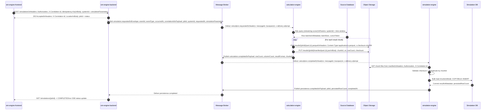
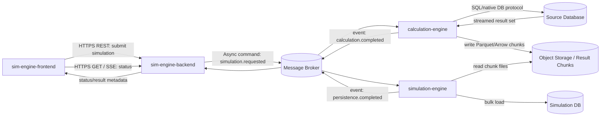
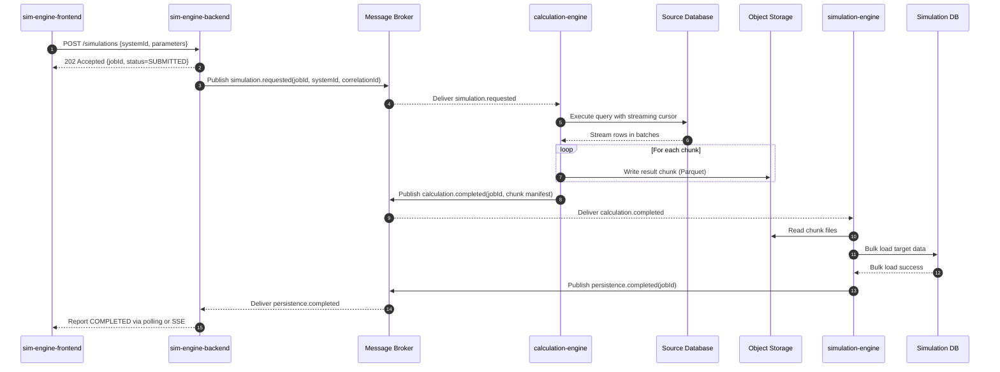
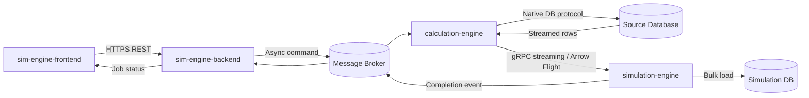

# Introduction

This specification captures the recommended integration architecture for a workflow involving `sim-engine-frontend`, `sim-engine-backend`, `calculation-engine`, a source database, and a target simulation database.

The key challenge is transporting and persisting a large tabular result set of approximately **1,000,000 rows** with **50 columns** reliably, efficiently, and without forcing a synchronous end-to-end response.

## 1. Purpose & Scope

This specification defines the recommended protocols, interaction patterns, data movement constraints, and design decisions for the simulation integration flow.

### In Scope
- Communication between:
  - `sim-engine-frontend`
  - `sim-engine-backend`
  - `calculation-engine`
  - source database
  - `simulation-engine`
  - target simulation database
- Protocol selection for control-plane and data-plane communication.
- Handling of large result sets.
- Persistence strategy for the simulation engine.
- Reliability, observability, retry, and idempotency expectations.
- Mermaid diagrams describing the architecture and sequence flow.

### Out of Scope
- Detailed table schema for the 50-column dataset.
- Cloud-vendor-specific deployment decisions.
- Detailed authentication and authorization implementation.
- Exact retention periods for intermediate result files.

### Intended Audience
- Solution architects
- Backend developers
- Platform engineers
- Data engineers
- DevOps and SRE teams
- AI coding agents

### Assumptions
- `sim-engine-frontend` is user-facing.
- `sim-engine-backend` orchestrates the workflow.
- `calculation-engine` retrieves large result sets from a source database using `systemId`.
- `simulation-engine` persists the final dataset into a separate target database.
- The 1,000,000-row result must not be transferred through all services as one synchronous JSON payload.

## 2. Definitions

- **Control Plane**: Communication used for commands, acknowledgements, statuses, and metadata.
- **Data Plane**: Communication used for transferring the bulk result dataset.
- **Job ID**: Unique identifier for a simulation request lifecycle.
- **Correlation ID**: Unique identifier used to trace a request across services.
- **Chunk**: A bounded subset of a larger dataset processed independently.
- **Object Storage**: Durable file/blob storage for intermediate result files.
- **Parquet**: Columnar file format optimized for large tabular datasets.
- **Bulk Load**: High-throughput database-native ingestion such as `COPY`, `BULK INSERT`, or equivalent.
- **SSE**: Server-Sent Events.
- **gRPC Streaming**: Incremental transfer using streamed RPC messages.
- **Arrow Flight**: High-performance protocol for large tabular transfer based on Apache Arrow.
- **Idempotency**: Property where repeated processing of the same work unit does not create duplicate final results.

## 3. Requirements, Constraints & Guidelines

- **REQ-001**: The frontend shall submit simulation requests to the backend using a synchronous user-facing request.
- **REQ-002**: The backend shall return a `jobId` immediately after accepting a request.
- **REQ-003**: The backend shall propagate `jobId`, `correlationId`, and `systemId` to downstream services.
- **REQ-004**: The calculation engine shall retrieve source data using streaming or cursor-based access.
- **REQ-005**: The system shall support results of at least 1,000,000 rows and 50 columns.
- **REQ-006**: The simulation engine shall persist the full result into a separate target database.
- **REQ-007**: The system shall expose durable job state transitions.
- **REQ-008**: The system shall support retry without duplicate persistence.
- **REQ-009**: The design shall separate control-plane traffic from large data transfer.
- **REQ-010**: The design shall process results in chunks rather than as one monolithic payload.

- **SEC-001**: All inter-service communication shall be encrypted in transit.
- **SEC-002**: Database and storage access shall use managed credentials or secure secret storage.
- **SEC-003**: Intermediate result storage shall be access-controlled with least privilege.
- **SEC-004**: Bulk result metadata shall include integrity information such as checksums.
- **SEC-005**: Unauthorized retrieval of full result sets shall be prevented.

- **REL-001**: The design shall tolerate temporary downstream unavailability through asynchronous decoupling.
- **REL-002**: Bulk data transfer shall support restart at chunk or file level.
- **REL-003**: Duplicate control-message delivery shall not create duplicate target records.
- **REL-004**: Partial job failure shall be observable and recoverable at chunk level where feasible.

- **PER-001**: No service shall load the full 1,000,000-row result into memory as a single object.
- **PER-002**: The architecture shall prefer bulk-friendly protocols and formats for large data movement.
- **PER-003**: The simulation engine shall use bulk ingestion instead of row-by-row inserts.

- **CON-001**: The frontend shall not wait synchronously for the full 1,000,000-row result.
- **CON-002**: The backend shall not proxy the entire dataset through chained synchronous REST responses.
- **CON-003**: The calculation engine shall not emit the entire result as one JSON response.
- **CON-004**: Retries for control-plane messages and data-plane payloads shall be handled differently.

- **GUD-001**: Use REST for frontend submission and status retrieval.
- **GUD-002**: Use asynchronous messaging for orchestration between backend and downstream engines.
- **GUD-003**: Use object storage plus metadata events for large result handoff.
- **GUD-004**: Prefer Parquet for the large tabular result format.
- **GUD-005**: If direct service-to-service transfer is mandatory, prefer gRPC streaming or Arrow Flight over REST JSON.

- **PAT-001**: Use a job-based asynchronous workflow.
- **PAT-002**: Use explicit lifecycle states.
- **PAT-003**: Use file or chunk handoff for bulk results.
- **PAT-004**: Use chunk-level persistence checkpoints in the simulation engine.

## 4. Interfaces & Data Contracts

### 4.1 Protocol Recommendations by Hop

| Interface ID | Source | Target | Recommended Protocol | Payload Type | Purpose |
|---|---|---|---|---|---|
| IF-001 | `sim-engine-frontend` | `sim-engine-backend` | HTTPS REST | JSON | Submit simulation request |
| IF-002 | `sim-engine-backend` | `sim-engine-frontend` | HTTPS REST or SSE | JSON | Job status and progress |
| IF-003 | `sim-engine-backend` | Message broker | Asynchronous messaging | Avro / Protobuf / JSON | Publish simulation request command |
| IF-004 | Message broker | `calculation-engine` | Asynchronous messaging | Avro / Protobuf / JSON | Deliver simulation request command |
| IF-005 | `calculation-engine` | Source database | Native DB protocol | SQL + streamed result set | Retrieve source data |
| IF-006 | `calculation-engine` | Object storage | File upload protocol | Parquet files | Store result chunks |
| IF-007 | `calculation-engine` | Message broker | Asynchronous messaging | Metadata event | Publish calculation completion and manifest |
| IF-008 | Message broker | `simulation-engine` | Asynchronous messaging | Metadata event | Notify data availability |
| IF-009 | `simulation-engine` | Object storage | File download protocol | Parquet files | Read result chunks |
| IF-010 | `simulation-engine` | Target database | Native bulk-load protocol | File/chunk ingestion | Persist data |
| IF-011 | `simulation-engine` | Message broker | Asynchronous messaging | Metadata event | Publish persistence completion |

### 4.2 Recommended Request Contract

```json
{
  "jobId": "JOB-20260313-0001",
  "correlationId": "0f44d8d7-4a9c-4c0c-96a1-95d8f0b42101",
  "systemId": "SYS-12345",
  "requestedAt": "2026-03-13T10:15:30Z",
  "simulationParameters": {
    "fromDate": "2026-03-01",
    "toDate": "2026-03-31"
  }
}
```


## Appendix D: Protocol and Payload Detailed Sequence (Second Meeting)



### Payload and Header Reference

| Step | Protocol | Required headers/envelope | Example payload fields |
|---|---|---|---|
| FE -> SB submit | HTTPS REST | `Authorization`, `X-Correlation-Id`, `Idempotency-Key`, `Content-Type: application/json` | `systemId`, `simulationParameters.fromDate`, `simulationParameters.toDate` |
| SB -> MB `simulation.requested` | Broker event | `eventId`, `eventType`, `schemaVersion`, `occurredAt`, `correlationId`, `traceparent` | `jobId`, `systemId`, `requestedAt`, `simulationParameters` |
| CE -> MB `calculation.completed` | Broker event | `eventId`, `eventType`, `schemaVersion`, `occurredAt`, `correlationId`, `traceparent` | `jobId`, `status`, `resultFormat`, `rowCount`, `columnCount`, `chunks[]` |
| SE -> MB `persistence.completed` | Broker event | `eventId`, `eventType`, `schemaVersion`, `occurredAt`, `correlationId`, `traceparent` | `jobId`, `status`, `persistedRowCount`, `targetDataset`, `completedAt` |

#### Example 1: `POST /simulations`

```http
POST /simulations HTTP/1.1
Authorization: Bearer <token>
X-Correlation-Id: 0f44d8d7-4a9c-4c0c-96a1-95d8f0b42101
Idempotency-Key: 8e5c735a-3e5e-4a0a-9024-80f6d6a8cc34
Content-Type: application/json

{
  "systemId": "SYS-12345",
  "simulationParameters": {
    "fromDate": "2026-03-01",
    "toDate": "2026-03-31"
  }
}
```

#### Example 2: `simulation.requested` event envelope + payload

```json
{
  "eventId": "evt-9d84f0df",
  "eventType": "simulation.requested",
  "schemaVersion": "1.0",
  "occurredAt": "2026-03-15T10:15:30Z",
  "correlationId": "0f44d8d7-4a9c-4c0c-96a1-95d8f0b42101",
  "traceparent": "00-4bf92f3577b34da6a3ce929d0e0e4736-00f067aa0ba902b7-01",
  "payload": {
    "jobId": "JOB-20260315-0001",
    "systemId": "SYS-12345",
    "requestedAt": "2026-03-15T10:15:30Z",
    "simulationParameters": {
      "fromDate": "2026-03-01",
      "toDate": "2026-03-31"
    }
  }
}
```

#### Example 3: `calculation.completed` with chunk manifest details

```json
{
  "eventId": "evt-0a33c5a1",
  "eventType": "calculation.completed",
  "schemaVersion": "1.0",
  "occurredAt": "2026-03-15T10:37:12Z",
  "correlationId": "0f44d8d7-4a9c-4c0c-96a1-95d8f0b42101",
  "traceparent": "00-4bf92f3577b34da6a3ce929d0e0e4736-6f1c8f0d9111a2ba-01",
  "payload": {
    "jobId": "JOB-20260315-0001",
    "systemId": "SYS-12345",
    "status": "DATA_READY",
    "resultFormat": "parquet",
    "rowCount": 1000000,
    "columnCount": 50,
    "chunks": [
      {
        "chunkId": "part-0001",
        "uri": "s3://calc-results/JOB-20260315-0001/part-0001.parquet",
        "checksum": "sha256:2b2f5a...",
        "rowCount": 250000
      },
      {
        "chunkId": "part-0002",
        "uri": "s3://calc-results/JOB-20260315-0001/part-0002.parquet",
        "checksum": "sha256:8ec9c1...",
        "rowCount": 250000
      }
    ]
  }
}
```

#### Example 4: `persistence.completed`

```json
{
  "eventId": "evt-7ac2c0be",
  "eventType": "persistence.completed",
  "schemaVersion": "1.0",
  "occurredAt": "2026-03-15T10:42:00Z",
  "correlationId": "0f44d8d7-4a9c-4c0c-96a1-95d8f0b42101",
  "traceparent": "00-4bf92f3577b34da6a3ce929d0e0e4736-9f02f87de1cf0a61-01",
  "payload": {
    "jobId": "JOB-20260315-0001",
    "systemId": "SYS-12345",
    "status": "COMPLETED",
    "persistedRowCount": 1000000,
    "targetDataset": "simulation_result",
    "completedAt": "2026-03-15T10:42:00Z"
  }
}
```

### 4.3 Recommended Completion Event Contract

```json
{
  "jobId": "JOB-20260313-0001",
  "correlationId": "0f44d8d7-4a9c-4c0c-96a1-95d8f0b42101",
  "systemId": "SYS-12345",
  "status": "DATA_READY",
  "resultFormat": "parquet",
  "rowCount": 1000000,
  "columnCount": 50,
  "chunks": [
    {
      "chunkId": "part-0001",
      "uri": "s3://calc-results/JOB-20260313-0001/part-0001.parquet",
      "checksum": "sha256:abc123",
      "rowCount": 250000
    },
    {
      "chunkId": "part-0002",
      "uri": "s3://calc-results/JOB-20260313-0001/part-0002.parquet",
      "checksum": "sha256:def456",
      "rowCount": 250000
    }
  ]
}
```

### 4.4 Recommended Persistence Completion Event

```json
{
  "jobId": "JOB-20260313-0001",
  "correlationId": "0f44d8d7-4a9c-4c0c-96a1-95d8f0b42101",
  "systemId": "SYS-12345",
  "status": "COMPLETED",
  "persistedRowCount": 1000000,
  "targetDataset": "simulation_result",
  "completedAt": "2026-03-13T10:42:00Z"
}
```

### 4.5 Job State Model

| State | Meaning |
|---|---|
| `SUBMITTED` | Frontend request accepted |
| `QUEUED` | Downstream command queued |
| `RUNNING` | Calculation in progress |
| `DATA_READY` | Result chunks written and available |
| `PERSISTING` | Simulation engine loading target DB |
| `COMPLETED` | Persistence finished successfully |
| `FAILED` | Workflow failed |
| `PARTIAL_RETRY` | One or more chunks require retry |

### 4.6 Protocol Decision

#### Primary Recommended Design
- Frontend to backend: HTTPS REST
- Backend to frontend updates: polling or SSE
- Backend to engines: asynchronous messaging
- Calculation result handoff: object storage with Parquet chunks
- Simulation persistence: native bulk-load protocol

#### Alternative Direct-Streaming Design
If object storage is not acceptable and direct transfer is mandatory:
- Calculation engine to simulation engine: gRPC streaming or Arrow Flight
- Transfer unit: chunked stream
- Retry unit: chunk boundary
- Acknowledgement: chunk-level

#### Non-Recommended Design
- Synchronous REST JSON transport of the full 1,000,000-row result
- Row-by-row persistence into the simulation database
- Frontend waiting for full completion in a single HTTP response

## 5. Acceptance Criteria

- **AC-001**: Given a user submits a simulation request, When the backend accepts it, Then the backend returns a `jobId` immediately without waiting for calculation completion.
- **AC-002**: Given a request is accepted, When the backend publishes the work item, Then `jobId`, `correlationId`, and `systemId` are included.
- **AC-003**: Given the source dataset is large, When the calculation engine processes it, Then the engine uses streaming or cursor-based retrieval.
- **AC-004**: Given calculation completes, When the result becomes available, Then chunk metadata is published to downstream consumers.
- **AC-005**: Given the simulation engine receives result metadata, When it persists the dataset, Then it uses chunk-aware idempotent behavior.
- **AC-006**: Given the same completion event is delivered more than once, When processing occurs, Then duplicate target records are not created.
- **AC-007**: Given a client checks job status, When the job is active, Then the backend returns a valid lifecycle state.
- **AC-008**: Given a dataset of 1,000,000 rows and 50 columns, When the workflow executes, Then no single monolithic synchronous response is required across services.
- **AC-009**: Given object storage handoff is used, When a chunk is read, Then integrity can be validated using checksum metadata.
- **AC-010**: Given the direct-streaming alternative is used, When a transfer fails mid-stream, Then recovery occurs at a chunk boundary or checkpoint.

## 6. Test Automation Strategy

- **Test Levels**: Unit, integration, contract, performance, resilience.
- **Frameworks**: Service-native unit testing, broker integration tests, database integration tests, and load/performance tooling.
- **Test Data Management**:
  - synthetic 1,000,000-row datasets
  - reduced deterministic fixtures for fast tests
  - chunk manifests with valid and invalid checksum cases
- **CI/CD Integration**:
  - run unit and contract tests on pull requests
  - run integration tests for broker, storage, and status flows
  - run scheduled or gated load tests for high-volume scenarios
- **Coverage Requirements**:
  - all state transitions covered
  - duplicate-delivery handling covered
  - chunk retry behavior covered
  - persistence failure behavior covered
- **Performance Testing**:
  - verify bounded memory usage
  - verify throughput of chunk writing and bulk loading
  - verify end-to-end latency against target SLAs
- **Resilience Testing**:
  - duplicate event delivery
  - missing chunk file
  - checksum mismatch
  - transient object storage failure
  - transient target DB failure

## 7. Rationale & Context

This workflow is dominated by large tabular data movement rather than by user-request complexity. The recommended design separates small orchestration messages from bulk dataset transfer.

The preferred implementation uses:
- REST for user submission and status retrieval
- asynchronous messaging for orchestration
- object storage plus Parquet for bulk result handoff
- bulk loading for target persistence

This reduces timeout risk, memory pressure, retry blast radius, and service coupling while improving resilience, observability, restartability, and throughput.

## 8. Dependencies & External Integrations

### External Systems
- **EXT-001**: Source database queried by the calculation engine.
- **EXT-002**: Target simulation database used by the simulation engine.
- **EXT-003**: User-facing frontend client.

### Third-Party Services
- **SVC-001**: Message broker for commands and events.
- **SVC-002**: Object storage for intermediate result files.

### Infrastructure Dependencies
- **INF-001**: Secure network connectivity between services and data stores.
- **INF-002**: Durable state store for job metadata and progress.
- **INF-003**: Logging and tracing with support for `correlationId`.
- **INF-004**: Sufficient compute resources for chunk generation and bulk ingestion.

### Data Dependencies
- **DAT-001**: Source dataset containing approximately 1,000,000 rows and 50 columns.
- **DAT-002**: Chunk manifest metadata.
- **DAT-003**: Target database format compatible with bulk ingestion.

### Technology Platform Dependencies
- **PLT-001**: HTTPS-capable API platform.
- **PLT-002**: Durable messaging platform.
- **PLT-003**: Bulk-friendly file format such as Parquet.
- **PLT-004**: Database drivers supporting streaming reads and bulk writes.
- **PLT-005**: Optional gRPC or Arrow Flight support for direct streaming.

### Compliance Dependencies
- **COM-001**: Data protection for large datasets in transit and at rest.
- **COM-002**: Auditability of lifecycle events.
- **COM-003**: Intermediate data retention and deletion policies.

**Note**: This section describes required capabilities, not specific package versions.

## 9. Examples & Edge Cases

```code
// Example response to frontend submission
HTTP/1.1 202 Accepted
{
  "jobId": "JOB-20260313-0001",
  "status": "SUBMITTED"
}

// Edge case: completion event delivered twice.
// Expected: idempotent chunk processing, no duplicate persistence.

// Edge case: one chunk file fails checksum validation.
// Expected: retry that chunk only, not the full job.

// Edge case: target DB fails after some chunks were committed.
// Expected: resume from checkpoint or reconcile processed chunks.
```

## 10. Validation Criteria

- **VAL-001**: Backend returns a durable `jobId` immediately after accepting a request.
- **VAL-002**: Downstream command contains `jobId`, `correlationId`, and `systemId`.
- **VAL-003**: Calculation engine uses streaming or cursor-based retrieval from the source DB.
- **VAL-004**: No service holds the full dataset in memory as one unit.
- **VAL-005**: Bulk data transfer occurs via chunked handoff or chunked streaming.
- **VAL-006**: Simulation engine uses bulk-load semantics or equivalent high-throughput persistence.
- **VAL-007**: Duplicate event delivery does not create duplicate target records.
- **VAL-008**: Job state transitions are durable and queryable.
- **VAL-009**: Integrity validation is available for chunked transfer.
- **VAL-010**: Implemented architecture remains consistent with this specification and diagrams.

## 11. Related Specifications / Further Reading

- `spec/README.md`
- `spec/spec-process-job-lifecycle.md`
- `spec/spec-data-calculation-completed-event.md`
- `spec/spec-data-persistence-completed-event.md`
- `documentation/appendix-a-recommended-architecture-diagram.mmd`
- `documentation/appendix-b-recommended-sequence-diagram.mmd`
- `documentation/appendix-c-direct-streaming-alternative-diagram.mmd`
- `documentation/calculation-completed-event.json`
- `documentation/persistence-completed-event.json`
- Selected message broker documentation
- Selected object storage documentation
- Target database bulk-load documentation

## 12. Production Readiness Addendum

### 12.1 Service Level Objectives (SLOs)

| SLO ID | Indicator | Target |
|---|---|---|
| SLO-001 | Job acceptance latency (`POST /simulations`) | p95 <= 500 ms |
| SLO-002 | End-to-end completion latency (`SUBMITTED` -> `COMPLETED`) | p95 <= 30 min |
| SLO-003 | Successful job completion rate | >= 99.0% per rolling 30 days |
| SLO-004 | Duplicate-processing defects | 0 duplicate persisted records from duplicate events |
| SLO-005 | Recovery objective for transient failures | automatic recovery or retry within 15 min |

### 12.2 Capacity and Chunking Baseline

- **CAP-001**: Capacity planning shall assume at least 1,000,000 rows x 50 columns per job.
- **CAP-002**: Chunk size should target 128 MB to 512 MB compressed Parquet objects.
- **CAP-003**: A single job should be split into multiple chunks (recommended minimum: 8) to enable parallel read/write and partial retry.
- **CAP-004**: Simulation-engine bulk-load throughput target shall be validated against expected peak concurrent jobs.
- **CAP-005**: Memory usage in calculation-engine and simulation-engine shall remain bounded by chunk-level processing, not total job size.

### 12.3 Retry, Backoff, and Dead-Letter Policy

| Policy ID | Scope | Retry Strategy | Terminal Handling |
|---|---|---|---|
| RBP-001 | Broker message consumption | exponential backoff with jitter, max 10 attempts | move to DLQ with error classification |
| RBP-002 | Object storage read/write | exponential backoff with jitter, max 7 attempts | mark chunk failed and emit failure event |
| RBP-003 | Target DB bulk load | bounded retries for transient DB errors, max 5 attempts | checkpoint and transition job to `FAILED` |
| RBP-004 | Frontend polling/status APIs | no server-side replay side effects | return current durable state |

- **RBP-005**: DLQ messages shall include `jobId`, `chunkId` (if applicable), last error, and attempt count.
- **RBP-006**: DLQ backlog alerts shall be treated as operational incidents.

### 12.4 Idempotency and Consistency Pattern

- **IDC-001**: Backend submission shall enforce idempotency using `Idempotency-Key` and request fingerprinting.
- **IDC-002**: Simulation-engine shall deduplicate using a durable key at minimum on `jobId + chunkId`.
- **IDC-003**: Completion event handling shall be idempotent on `eventId` and `jobId`.
- **IDC-004**: Checkpoint state shall persist per chunk with states: `PENDING`, `LOADED`, `VERIFIED`.
- **IDC-005**: Event publication should use an outbox-style pattern where dual-write risk exists.

### 12.5 Event and Schema Evolution Rules

| Rule ID | Rule |
|---|---|
| SCH-001 | All events shall include `schemaVersion` and preserve backward compatibility for at least one prior version. |
| SCH-002 | New fields must be additive and optional by default; removals require a deprecation window. |
| SCH-003 | `calculation.completed` and `persistence.completed` contracts require contract-test validation in CI. |
| SCH-004 | Avro schema changes in `src/main/avro/user_event.avsc` must regenerate sources and pass `mvn -B clean verify`. |

### 12.6 Security Threat Model Summary

| Threat ID | Threat | Required Mitigation |
|---|---|---|
| THR-001 | Unauthorized access to chunk objects | least-privilege IAM, private buckets/containers, short-lived credentials |
| THR-002 | Chunk tampering in transit or at rest | checksum validation (`sha256`) before load, TLS in transit |
| THR-003 | Replay of broker events | idempotent consumer logic keyed by `eventId` and `jobId` |
| THR-004 | Correlation spoofing | generate trusted correlation IDs at edge; validate format downstream |
| THR-005 | Excessive actuator exposure | explicit endpoint allowlist, no permissive defaults |

- **SEC-PR-001**: Dependency scanning shall run in CI; HIGH and CRITICAL findings are release blockers.
- **SEC-PR-002**: No credentials, tokens, or secrets shall be committed in source or config.

### 12.7 Observability and Alerting Contract

| OBS ID | Signal | Alert Threshold |
|---|---|---|
| OBS-001 | End-to-end job completion latency | p95 breach for 15 minutes |
| OBS-002 | Job failure ratio | > 2% failed jobs over 15 minutes |
| OBS-003 | DLQ growth | any sustained growth for 10 minutes |
| OBS-004 | Checksum validation failures | any non-zero in 5-minute window |
| OBS-005 | Stuck jobs in `DATA_READY` or `PERSISTING` | age > 20 minutes |

- **OBS-006**: Logs shall include `jobId`, `correlationId`, `eventId`, `chunkId`, and `attempt` where applicable.
- **OBS-007**: Distributed tracing shall propagate `traceparent` across HTTP and broker hops.

### 12.8 Operational Ownership and Runbook Triggers

| OPR ID | Trigger | Primary Owner | Required Action |
|---|---|---|---|
| OPR-001 | DLQ backlog exceeds threshold | Platform/SRE | triage poison messages and re-drive strategy |
| OPR-002 | Repeated checksum failures | Calculation-engine team | investigate source/chunk generation integrity |
| OPR-003 | Bulk-load timeout or lock contention | Simulation-engine + DBA | execute DB load runbook and tune batch/chunk settings |
| OPR-004 | SLO breach for end-to-end completion | Service owners | incident response and capacity review |

- **OPR-005**: A release is production-ready only if SLO dashboard links, alert routes, and runbook references are present in the deployment record.

## Appendix A: Recommended Architecture Diagram


### Why object storage and result chunks are used

Object storage and chunked results solve the large\-data transport problem safely and reliably.

### Key benefits

- **Control plane vs. data plane separation**: Services exchange small messages \(`jobId`, status, manifest\), while large datasets stay in storage.
- **No giant synchronous payloads**: Avoids pushing 1M rows through chained REST calls, reducing timeout and memory risks.
- **Chunk\-level retry and resume**: If one chunk fails, only that chunk is retried.
- **Higher performance**: Parquet chunk I/O is typically faster and cheaper than very large JSON payload chains; the simulation engine can bulk\-load efficiently.
- **Decoupling and elasticity**: `calculation\-engine` and `simulation\-engine` can run independently and at different speeds.
- **Operational safety**: Manifests, checksums, and metadata enable integrity checks, idempotency, and auditability.
- **Parallelism**: Multiple chunks can be uploaded, downloaded, and loaded concurrently for better throughput.
- **Lower fragility at scale**: Services avoid becoming heavy data pipes.

### When object storage might be skipped

- Data volume is small or moderate.
- Ultra\-low\-latency streaming is mandatory.
- End\-to\-end gRPC/Arrow streaming with checkpointing is robustly guaranteed.

For this workload, object storage plus chunk manifests is typically the most reliable default.

## Appendix B: Recommended Sequence Diagram



## Appendix C: Direct Streaming Alternative Diagram



